## 2026-08-10 — docs: refresh README for Postgres and campaign header actions

The README's "Running it locally" section still walked through the old
local-SQLite flow (npx prisma migrate dev against a dev.db file) even
though the app moved to hosted Postgres and per-visitor cookie identity
back on 2026-08-04. Replaced it with the current .env/DATABASE_URL setup
(Neon via npx create-db) and added a note on the anonymous httpOnly
identity cookie (src/proxy.ts) that scopes each fund privately.

Also documented the End Campaign / Restart Campaign header actions under
Campaign mode, fixed the Tech stack section (still said SQLite /
better-sqlite3), updated the "out of scope" bullet from "Multi-user
accounts" to "Real user accounts/login" now that funds are scoped per
anonymous visitor, and added src/proxy.ts to the project structure
listing.

Co-Authored-By: Claude Sonnet 5 <noreply@anthropic.com>

## 2026-08-04 — Add End Campaign / Restart Campaign to the active-run header

Replaces "Quit campaign" (which wiped the run and dropped you back to
the title screen) with two distinct actions in the header, matched in
visual weight via .max-btn-outline and differentiated only by accent
color (orange/magenta) — a bigger .max-btn-primary treatment on
Restart was drawing more attention than the campaign itself.

End Campaign (new endCampaign() action, EndCampaignButton) closes the
fund exactly where it stands — same status flip advanceYear does at
year GAME_YEARS, without rolling another year. The scorecard detects
game.year < GAME_YEARS and swaps the quartile-grade box for neutral
"early close" copy in place, since gradeFund's thresholds assume a
full-length run; reputation, the dashboard, fund log, graveyard, and
save-as-scenario are unaffected either way.

Restart Campaign reuses StartCampaignButton as-is (now with an
optional outline variant used only in this header placement) — same
wipe-and-deal-fresh-year-1 behavior as its other two placements, no
tutorial detour. Also nudged the header's floating rocket/money-bag/
chart decorations lower so the new button row doesn't cover them.

Co-Authored-By: Claude Sonnet 5 <noreply@anthropic.com>

## 2026-08-04 — Migrate from local SQLite to hosted Postgres

Phase 1 of moving off a local dev.db file: schema datasource is now
postgresql, and the Prisma client (src/lib/prisma.ts, prisma/seed.ts)
swaps @prisma/adapter-better-sqlite3 for @prisma/adapter-pg — this
Prisma 7 client generator requires a driver adapter for every
datasource, so "no adapter" wasn't actually on the table for
Postgres either. Reset the migration history (the old SQLite-dialect
SQL doesn't apply to Postgres; full history stays in git log) and
generated one fresh init_postgres migration against a real Neon
database. scripts/migrate-to-postgres.ts copies every row out of the
local SQLite file into Postgres via raw better-sqlite3 reads +
Prisma writes, preserving ids/relations; row counts verified to match
on all 7 tables. Added .env.example (and fixed a real gitignore bug:
.env* was silently swallowing .env.example too, so it could never
have been committed as a template). No component, page, or server
action needed changes — verified the full write surface (add/edit/
delete a company, add/edit a round, simulate a year, start/advance a
campaign) against the live Postgres database.

Co-Authored-By: Claude Sonnet 5 <noreply@anthropic.com>

## 2026-08-03 — Fix hydration mismatch on the company detail page's stake sparkline

StakeSparkline gave each point's SVG <title> array children
({date}: {value}) instead of one string, which React can't reconcile
between server and client render — every visit to a company page
discarded and re-rendered the whole tree client-side. Collapsed it
into a single template string.

Co-Authored-By: Claude Sonnet 5 <noreply@anthropic.com>

## 2026-08-03 — Prevent duplicate company names within the same year's deal flow

dealFlow() now tracks the names used in a year's batch and retries
generateDeal() on a collision, so two pitches (including a founder
referral) can never share a name in the same deck — the case a
playthrough actually hit. Also widened the name-generator's word
pools (20→46 prefixes, 15→30 suffixes) to cut collision odds further
before the retry even matters.

Co-Authored-By: Claude Sonnet 5 <noreply@anthropic.com>

## 2026-08-03 — Scale reputation cost by founder track record, and add founder referrals

Reputation was trivially maxable: always respond, never ghost, no real
tradeoff. Three changes against the existing scenario-pool architecture:

CompanyDynState.trackRecord counts asks a company has had honored
(bridge funded, follow-on funded, pivot backed, top-tier lead signed,
CEO kept). Refusing a bridge or sitting out a follow-on now costs more
reputation once a founder crosses GOOD_TRACK_RECORD_THRESHOLD
(isEstablishedFounder) — "declined_costly" prices the refusal apart
from a plain "declined" the same way "ousted" already prices apart
from "resolved". Previously, sitting out a follow-on wasn't tracked
for reputation at all.

The competing-term-sheet decision now splits reputation from
financial outcome: backing the founder's flattering price is
reputation-positive (its own "resolved_flattering" status) but stays
the financially worse choice; the disciplined top-tier lead is
reputation-neutral instead of earning the same flat credit as any
other founder call.

Once a company's track record clears a much higher
REFERRAL_TRACK_RECORD_THRESHOLD, it can refer a new deal into your
flow during the investment period — generated through the same
generateDeal()/fact-pool path with reduced (never zero) noise, so a
referral reads clearer without ever guaranteeing quality. Deal/Company
gain a nullable referredBy, shown as a small badge on the deal card.

All thresholds and reputation deltas are named, tunable constants.
Added 9 tests to campaign.test.ts covering the track-record refusal
scaling, the term-sheet reputation/finance split, and referral
eligibility/noise/quality guarantees.

Co-Authored-By: Claude Sonnet 5 <noreply@anthropic.com>

## 2026-08-03 — Document scenario pools, the fact-card generator, and company descriptions in README

Adds "Weighted scenario pools & chaining state," "Due-diligence fact
pool & card generator," and "Company descriptions" sections to the
README, updates the campaign-mode bullets to reference them, and
brings the project-structure tree up to date with scenario-pool.ts,
fact-card.ts, facts.json, random-startup.ts, and scripts/generate-card.ts.

Co-Authored-By: Claude Sonnet 5 <noreply@anthropic.com>

## 2026-08-03 — Replace fund settings number spinners with one-click presets

step=1 arrows were useless for values in the millions. Preset chips
(fund size: 5M/10M/25M/50M/100M, max companies: 5/10/15/20/30) cover
common values in one click, with a "Custom..." toggle that swaps in
the plain number input for anything else.

Co-Authored-By: Claude Sonnet 5 <noreply@anthropic.com>

## 2026-08-03 — Move fund settings link beside Start a new fund as an outlined button

Stacked plain text under a bold gradient CTA read as a footnote and
implied sequence (do this, then that). Side-by-side outlined buttons
present both as equal, independent next steps.

Co-Authored-By: Claude Sonnet 5 <noreply@anthropic.com>

## 2026-08-03 — Add fund settings link to the scorecard's start-again row

Placed next to "Start a new fund" so adjusting fund size or max
companies reads as part of the same decision as starting the next run.

Co-Authored-By: Claude Sonnet 5 <noreply@anthropic.com>

## 2026-08-03 — Nudge header rocket emoji down to clear Quit campaign confirm text

The rocket sat at the same height as the Quit campaign confirm row,
overlapping "End this run for good?" when the button was clicked.

Co-Authored-By: Claude Sonnet 5 <noreply@anthropic.com>

## 2026-08-03 — Add Quit campaign button to the active-play header

Sits next to Home, matching the header's existing chrome, with the
same inline confirm pattern used by the other destructive buttons
(Start a new fund, Delete company). Wipes the portfolio and deals
without dealing a fresh fund, so /play falls back to the title screen.

Co-Authored-By: Claude Sonnet 5 <noreply@anthropic.com>

## 2026-08-03 — Stack campaign deal cards vertically, unify description text size

2x2 grid squeezed cards with more signals against ones with fewer;
a vertical stack lets each card size to its own content. Also bumped
the description line from text-xs to text-sm to match the rest of
the card's copy.

Co-Authored-By: Claude Sonnet 5 <noreply@anthropic.com>

## 2026-08-03 — Update Back a Company subheader to drop real-startup mention

Follows up the preset removal — the subheader still referenced
investing in a real startup's early round.

Co-Authored-By: Claude Sonnet 5 <noreply@anthropic.com>

## 2026-08-03 — Remove real-startup presets from the investment picker

Drops the "pick a real startup" section (Stripe, Figma, Airbnb, etc.)
to avoid using real companies' names and figures indefinitely.
Free-play now only offers a blank form or a randomized fake startup.

Co-Authored-By: Claude Sonnet 5 <noreply@anthropic.com>

## 2026-08-03 — Persist description onto Company and show it on the company page

Description now survives past the picker: free-play form carries it
through a hidden field, campaign investments copy it from the deal,
and the company detail page displays it under the name.

Co-Authored-By: Claude Sonnet 5 <noreply@anthropic.com>

## 2026-08-03 — Add randomized per-sector company descriptions

Random and dealt startups now roll a cosmetic one-line description
(60% realistic, 40% fun) per sector, shown wherever preset blurbs
already appear. Purely flavor text — never touches hidden quality.

Co-Authored-By: Claude Sonnet 5 <noreply@anthropic.com>

## 2026-08-03 — Wire the due-diligence fact pool into campaign deal generation

generateDeal() now draws 3-5 facts from fact-card.ts instead of the
old flat 15-item SIGNALS list, deriving hidden quality from each
fact's sentiment_tag. Deal/decision cards needed no changes since
they just render signals: string[].

Co-Authored-By: Claude Sonnet 5 <noreply@anthropic.com>

## 2026-08-03 — Add fact pool and card generator for due-diligence playtesting

Structured fact data (facts.json) with range/tiered_list number
substitution and an exclusion list to prevent contradictory facts
from co-occurring. Run via `npm run cards`.

Co-Authored-By: Claude Sonnet 5 <noreply@anthropic.com>

## 2026-08-03 — Add weighted scenario pools and split card shadows from flat boxes

Reworks campaign event selection: portfolio-company scenarios (bridge,
pivot, ceo replacement, exit route, acquisition) now draw from a
weighted pool gated by stage/postMoney/performance instead of a
hardcoded if/else chain. A per-company CompanyDynState (variance
multiplier, bridge history, removed-from-pool flag) is written by past
decisions and read by future weighting, so funding a bridge, declining
one, or backing/urging-focus-on a pivot changes the odds of what
happens to that company next. Adds fund_secondary as a new
pool-eligible scenario (mirrors an acquisition offer but for the
fund's own stake in a winner), plus macro_shock (a portfolio-wide
reweight for the year) and reserves_scarcity (a summary flag when
fresh asks outrun remaining capital).

Also splits the maximalist `.max-card` box treatment in two: a
shadowed variant kept for buttons and one-off high-stakes moments
(the campaign start screen), and a new `.max-card-flat` for
everything that repeats many-at-once — HUD tiles, deal grids, forms,
tooltips, data panels, and now the active decision card and the
game-over grade/reputation cards too. Fixes a bug where a hovered
tooltip could render behind a sibling card: `backdrop-filter` gives
each card its own stacking context, so cards hosting a Term/hint
tooltip now raise that context on hover/focus-within.

Co-Authored-By: Claude Sonnet 5 <noreply@anthropic.com>

## 2026-08-02 — Restyle settings, guide, and scenarios with the maximalist design system

Completes the app-wide rollout: fund settings form, the learning
guide's cards (each now with a rotating accent border), and the
scenarios comparison table all move to the dark maximalist skin.
SaveScenarioForm and ScenarioActions are fully dark since their only
remaining consumer (/scenarios) is now maximalist too.

No page in the app still uses the old light `.app-bg` background.

Before → after:

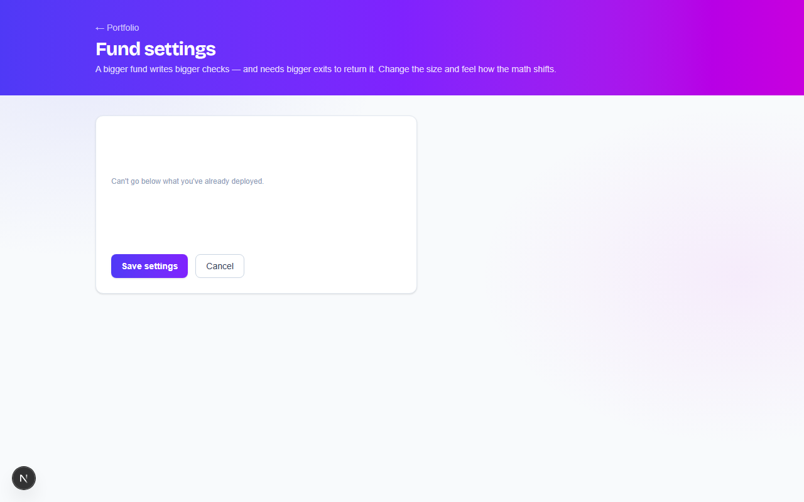
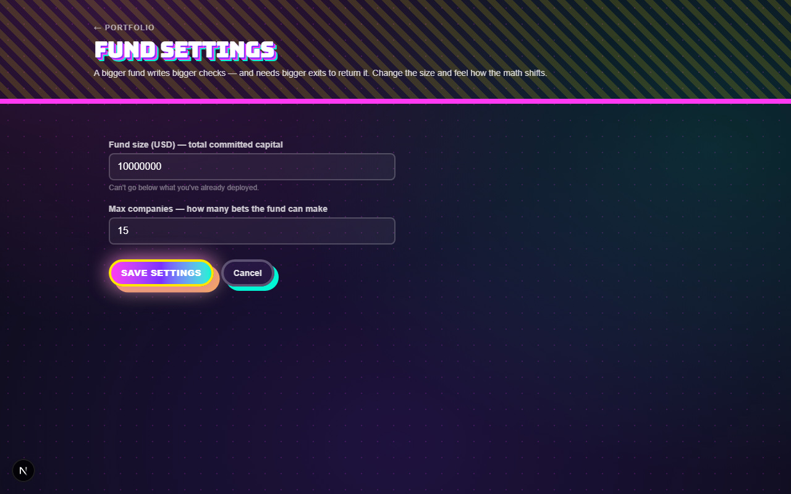
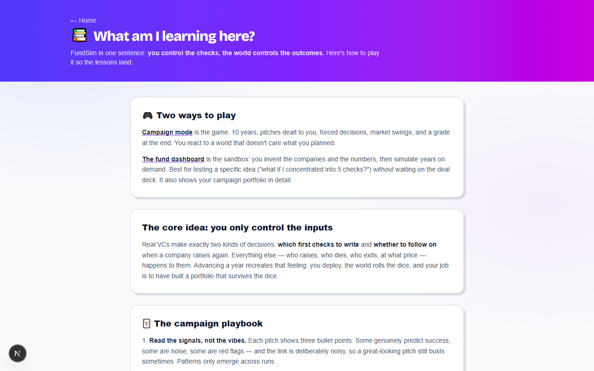
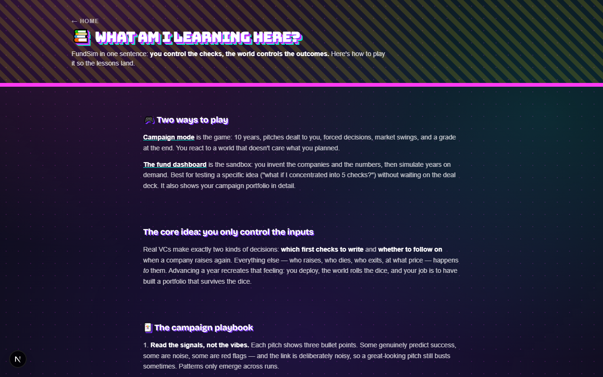
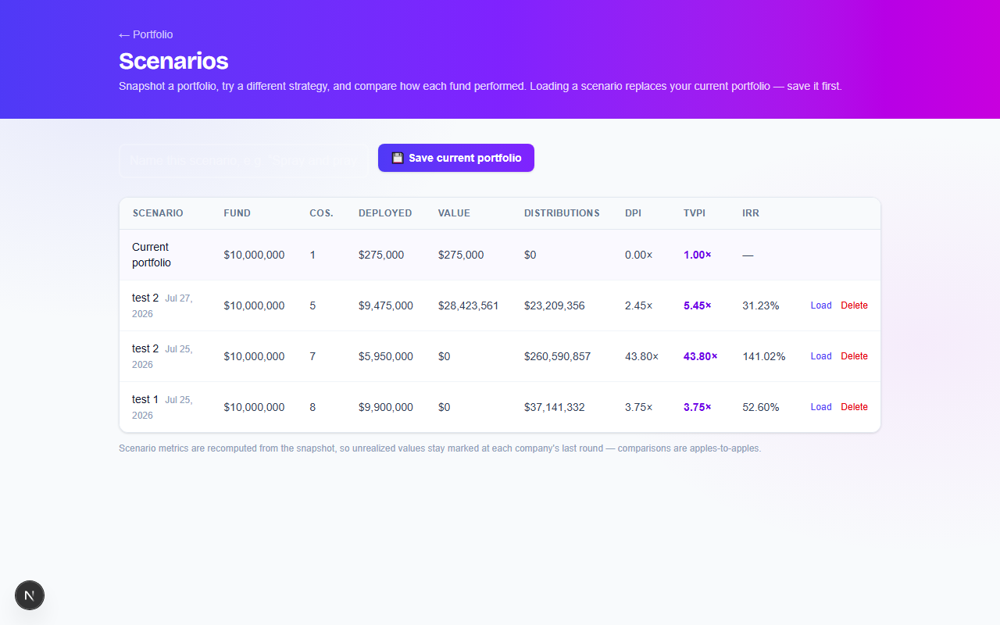
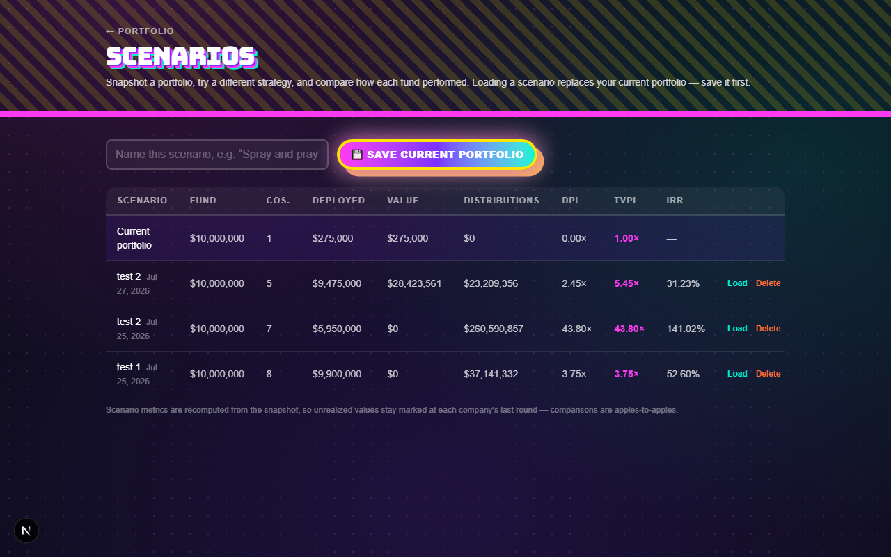

Co-Authored-By: Claude Sonnet 5 <noreply@anthropic.com>

## 2026-08-02 — Restyle the companies pages with the maximalist design system

Applies the dark maximalist skin to backing a company, the company
detail page, and the round/exit forms. RoundFields' shared input
styling is now dark by default, which also fixes the pro-rata/
pay-to-play number inputs on the campaign screen that were left
light in an earlier pass. StatCard, StakeSparkline, and the round/
exit delete-undo buttons are fully dark since they're now only ever
rendered from maximalist pages.

Before → after:

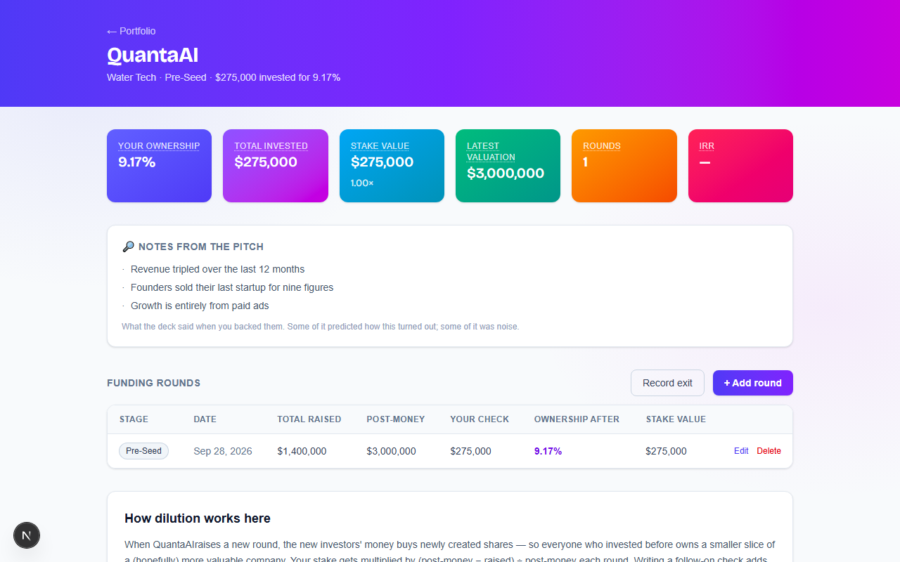
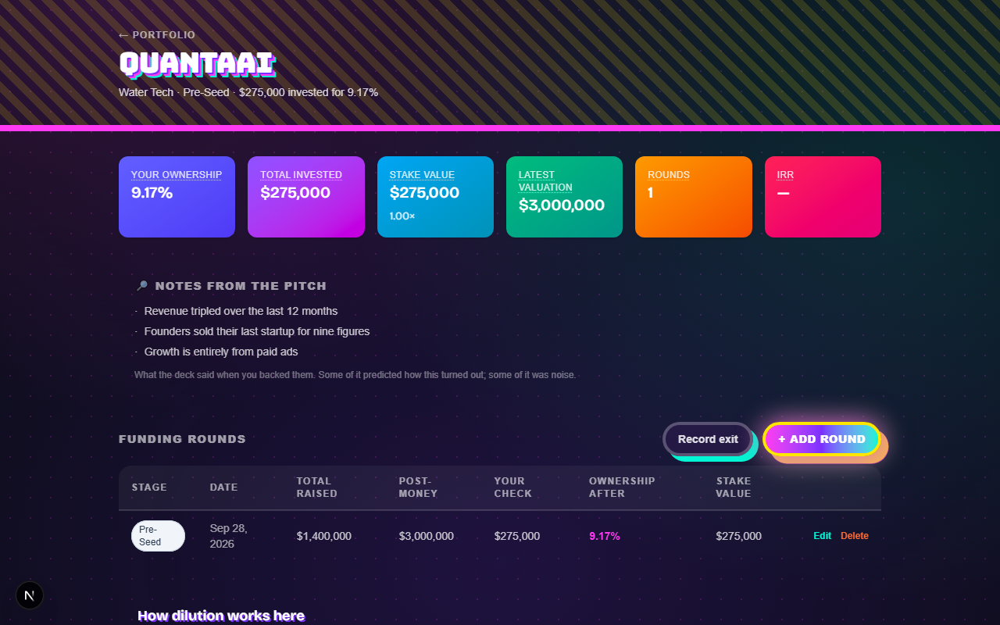

Co-Authored-By: Claude Sonnet 5 <noreply@anthropic.com>

## 2026-08-02 — Restyle the Fund Dashboard with the maximalist design system

Applies the same dark maximalist skin used on the homepage and
campaign screen to /dashboard: header, summary stats, chart and
portfolio table frames, "how it works" steps, and the dashboard's
own buttons (simulate year, clear all, back a company, chart toggle).

CompanyTable and DeleteCompanyButton are now fully dark themselves
(not just framed) since they're only ever rendered from the
already-maximalist dashboard and campaign screens.

Before → after:

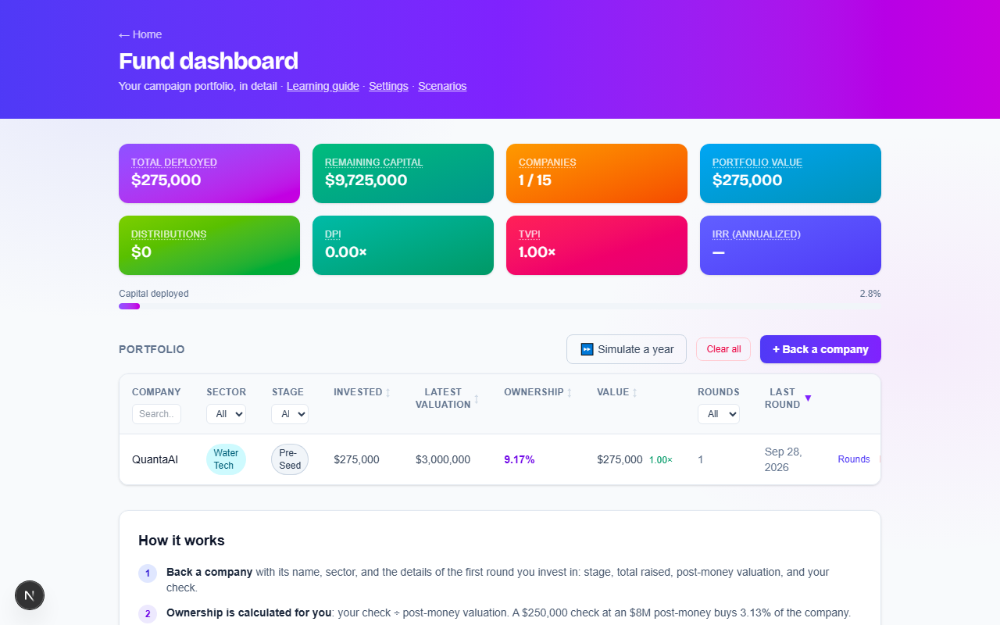
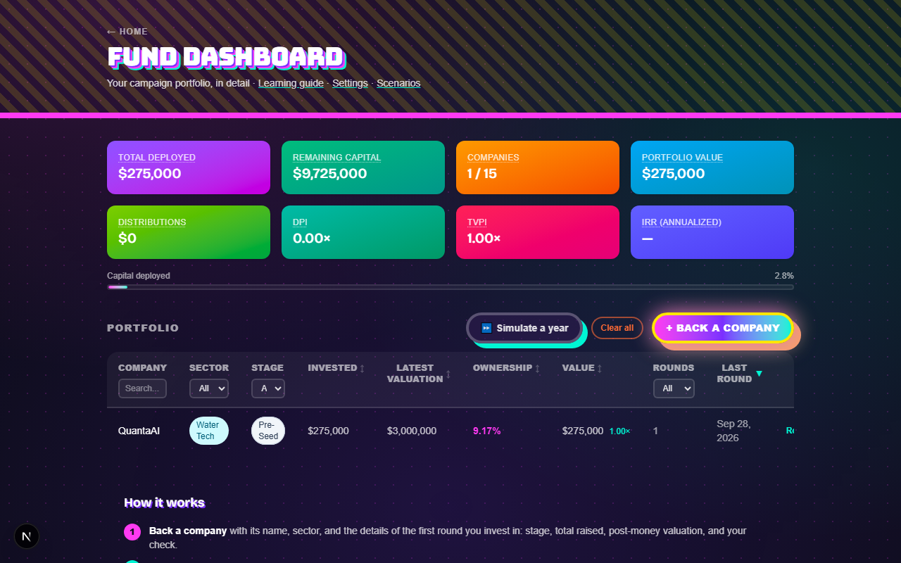

Co-Authored-By: Claude Sonnet 5 <noreply@anthropic.com>

## 2026-08-02 — Restyle the campaign (/play) screen with the maximalist design system

Applies the homepage's dark maximalist skin to all three campaign
states — title screen, active play, and the game-over scorecard —
plus the deal/decision cards, HUD stats, portfolio panel, fund log,
tips, tutorial, and toasts. Adds reusable .max-card/.max-chip-box/
.max-stamp utilities so the campaign components share the glass-panel
and clashing-border recipe instead of repeating it inline.

Left CompanyTable, FundChart, and sector chip styling untouched since
they're still shared with the light-themed dashboard/company pages —
they now sit inside a dark frame instead.

Before → after:

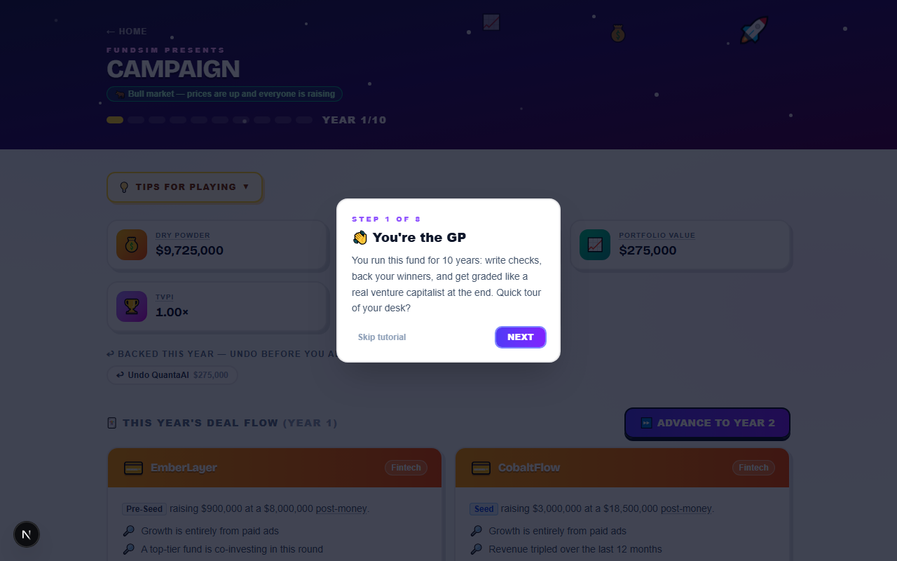
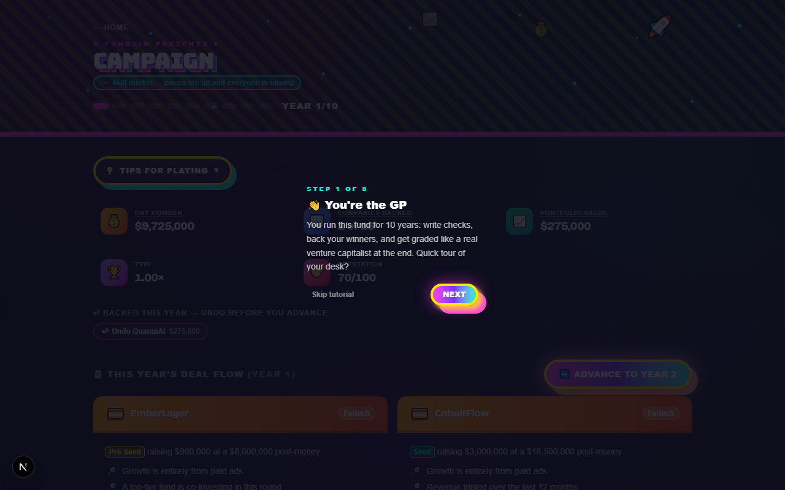

Co-Authored-By: Claude Sonnet 5 <noreply@anthropic.com>

## 2026-08-02 — Remove the light/dark mode toggle app-wide

Deletes the ThemeToggle component and its usage across every page,
and drops the localStorage/system-preference dark-class logic from
the root layout script, leaving each page's current appearance as
the only mode.

Co-Authored-By: Claude Sonnet 5 <noreply@anthropic.com>

## 2026-08-02 — Redesign homepage with a maximalist/dopamine design system

Rebuilds the hero, Learning Guide, and Fund Dashboard sections around
five clashing accent colors, stacked hard shadows, cascading concept
cards, layered dot/grid/stripe backgrounds, and full-bleed section
dividers, replacing the previous plain white cards and light app-bg.

Before → after:

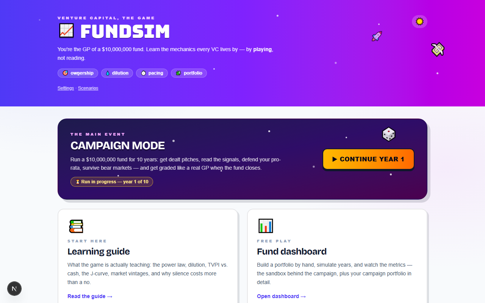
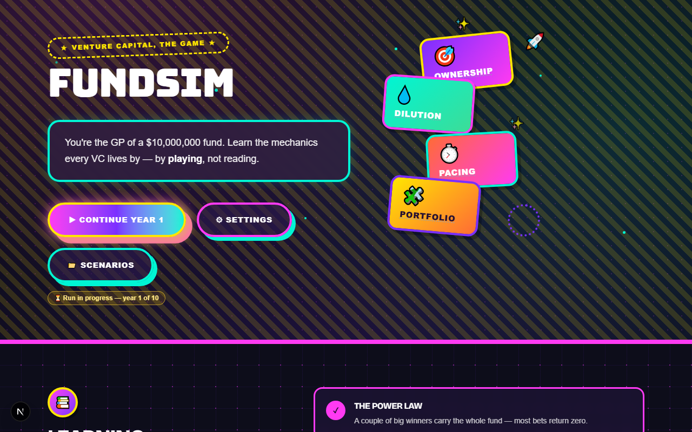

Co-Authored-By: Claude Sonnet 5 <noreply@anthropic.com>

## 2026-08-02 — chore: gitignore updates.txt

Riana's personal working-notes file, not a project doc — keep it out of
git status noise without moving it out of the repo.

Co-Authored-By: Claude Sonnet 5 <noreply@anthropic.com>

## 2026-08-02 — feat: swap the display face to Bricolage Grotesque, add Bungee as an accent

Space Grotesk out, Bricolage Grotesque in as --font-display — same wiring,
every element already using font-display (page h1s via the global rule,
stat numbers, the grade/reputation headlines, deal-card names) picks it up
automatically. Its slightly irregular letterforms read as more "indie
startup," less "enterprise SaaS," while staying legible in dense card text.

Bungee (a single heavy weight, poster-style) is wired in but deliberately
scoped to two spots only, confirmed against real mockups: the "FundSim"
wordmark on the home page, and the campaign grade reveal ("Top Decile"
etc.) — the one moment on the scorecard meant to feel like a payoff. Full
Bungee headers were too loud at repeated/paragraph-adjacent sizes.

Bug caught wiring it in: the global `h1 { font-family: ... }` rule lived
outside any Tailwind layer, so it beat the font-bungee utility regardless
of specificity (unlayered CSS always wins over layered CSS). Wrapped it in
@layer base so utility overrides work as expected. Verified via computed
styles: the wordmark and grade headline resolve to Bungee/400/uppercase,
every other h1 (dashboard, guide, campaign) stays on Bricolage Grotesque.

Co-Authored-By: Claude Sonnet 5 <noreply@anthropic.com>

## 2026-07-27 — feat: add Space Grotesk as the display face for headlines and numbers

Every heading and stat was set in Geist Sans, with "boldness" faked via
font-black + uppercase + tracking — readable, but flat next to the arcade
skin's colour and depth. Space Grotesk (500/600/700, no black weight is
served so font-black quietly resolves to 700) now carries: every page's
h1 via a global CSS rule, the campaign grade and reputation headlines, the
homepage's option cards, HUD/StatCard numbers, the "where the returns came
from" multiples, and pitch-card company names. Body copy, tables, and
small uppercase labels stay on Geist Sans, where a chunkier face hurts
legibility at small sizes.

Wired via next/font/google + a --font-display Tailwind v4 theme token, so
it's just `font-display` wherever it's opted into.

Co-Authored-By: Claude Sonnet 5 <noreply@anthropic.com>

## 2026-07-26 — style: give the pages depth, sector identity, and a power-law bar chart

Three passes at the flatness:

Depth. The arcade look rests on hard offset shadows, which are invisible
on a dark page — every surface sat at the same level below the header. A
.pop utility now carries the offset in light mode and switches to a
cool-tinted offset plus a lit top edge in dark, and .app-bg replaces the
flat fill with two soft viewport-anchored colour washes. Applied across
all eleven page shells and every card, so nothing drifts.

Power law. "Where the returns came from" gets a bar behind each row scaled
to the best position, and the multiple becomes a large tabular number tinted
by outcome. The fund's whole shape — one winner dwarfing everything, two
zeros — now reads in a glance instead of five identical rows of small text.

Sector identity. The mascots and colours from the pitch cards move to
src/lib/sectors.ts and follow companies into the fund log, the graveyard
and the scorecard. This also disambiguates duplicate names: a SaaS
HyperFlow that went bankrupt is now visibly not the Water Tech HyperFlow
that exited. campaignLog entries carry the sector for that reason, since
names are not unique.

Co-Authored-By: Claude Fable 5 <noreply@anthropic.com>

## 2026-07-26 — fix: put the year results under the deal-flow header, not beside it

The results panel lived inside the header row's right-hand column, so it
rendered as a narrow block squeezed against "This year's deal flow". The
advance control now owns the whole row — heading included — and the panel
drops below it at full width, with the tallies in two columns instead of
one long stack.

Co-Authored-By: Claude Fable 5 <noreply@anthropic.com>

## 2026-07-26 — style: size the campaign intro boxes to their own text

Grid rows stretch every cell to the tallest in the row, so the short
"deals expire" box was padded out to match its neighbour and read as half
empty. Flowing the boxes in columns lets each one end where its text does.
Also balances the heading so "years." stops landing alone on its own line.

Co-Authored-By: Claude Fable 5 <noreply@anthropic.com>

## 2026-07-26 — feat: three harder decisions — exit routes, board votes, pay-to-play

The campaign got easy once you learned to read signals, so add decisions
whose right answer isn't obvious even when you can read the company.

Exit strategy: a company that has grown up stops being a simple buyout
offer and asks how to get liquid. Going public has the highest ceiling and
a real chance of being pulled (worst in a bear market); selling the company
is certain today; selling your stake on the secondary takes risk off your
books at a discount and lets the company carry on. Only the IPO's outcome
is unknown when you choose it.

Board vote: replace the founder-CEO with a professional operator, or back
the founder. The operator reliably steadies the company; backing the
founder is the higher-variance answer. Ousting one costs more reputation
than any single no — the efficient call is the expensive one, tracked with
its own "ousted" status so it prices apart from simply answering.

Pay-to-play: a hard down round where insiders must fund their share or be
converted. Paying holds your stake; sitting out recaps it at a punishing
price. This model has no preference stack, so conversion is approximated as
a much worse effective price — same lesson.

Reputation gains foundersOusted; the Decision type/status comments widen
(no migration — both stay strings). 13 new unit tests cover the exit-route
pricing and pull odds, the pay-to-play recap and pro-rata check, the
founder-kept variance band, and the ousting penalty.

Co-Authored-By: Claude Fable 5 <noreply@anthropic.com>

## 2026-07-26 — fix: reset campaign state in the seed, not just the portfolio

The seed only cleared Company, so reseeding left the Game row and every
Deal behind. The app would then resume a campaign whose companies had
just been deleted, with Deals still marked "invested" pointing at nothing.

Delete Companies first — Company.dealId references Deal, and Rounds and
Decisions cascade off Company — then Deals, then Game.

Co-Authored-By: Claude Opus 5 <noreply@anthropic.com>

## 2026-07-26 — refactor: put the fund log before the dashboard on the scorecard

The log reads as the story of the run, so it comes first; the dashboard
follows it collapsed, matching how it behaves during a campaign.

Co-Authored-By: Claude Fable 5 <noreply@anthropic.com>

## 2026-07-26 — feat: fund log, in-campaign dashboard, and a fuller end-of-run scorecard

During a run you could see this year's cards but nothing about what had
already happened, and a company going bankrupt scrolled past unnoticed.

- campaignLog() derives a year-by-year history from the portfolio's own
  dated rounds and exits, so it can't drift from the data (unit-tested);
  rendered newest-first with bankruptcies called out in red
- the dashboard chart and portfolio table now appear inside campaign mode
  via a shared PortfolioPanel, collapsed during a run and open on the
  scorecard; toCompanyRows/toChartPoints share the shaping with /dashboard
- advancing a year now shows a proper results panel instead of one line of
  small text, with bankruptcies in a red callout, and fires a toast
- toasts are bigger (wider, larger type and icon) and last 5s not 3.5s

End of campaign also gains a graveyard listing every company that went to
zero with the capital sunk into it, the full dashboard, the fund log, and
a prominent "save this run" form so a finished fund can be kept as a
scenario before starting the next one.

Also fixes a missing space in the investment-period notice.

Co-Authored-By: Claude Fable 5 <noreply@anthropic.com>

## 2026-07-25 — style: show the stage as a colored badge in decisions too

Decision cards wrote the round's stage as plain text while pitch cards
showed the familiar colored chip. Extracts that chip into a shared
StageBadge so both render it identically and can't drift, and uses it for
the follow-on and term-sheet decisions.

Co-Authored-By: Claude Fable 5 <noreply@anthropic.com>

## 2026-07-25 — style: give decision cards a consistent rhythm and readable structure

The cards were a wall of prose with a floated stamp the copy had to wrap
around, and the numbers that drive each choice were buried mid-sentence.

- shared DecisionShell/DecisionActions so all five types space the same
  way, with a rule separating the ask from the context
- the stamp sits on its own line instead of floating
- pitch notes move into a tinted block as a bulleted list
- pro-rata and term-sheet trade-offs become side-by-side comparisons
  (sit out vs defend, top-tier vs hype), so the numbers can be weighed at
  a glance rather than parsed out of a paragraph
- acquisition proceeds and bridge dilution get the same treatment
- the follow-on check field is boxed so it stays beside its buttons

Co-Authored-By: Claude Fable 5 <noreply@anthropic.com>

## 2026-07-25 — refactor: drop the hover pitch notes, keep the inline recap

Decision cards were showing the same signals twice — once inline and
again in a hover on the company name. Inline wins: the notes are input to
the decision you're making, and hover is unreachable on touch and needs
extra handling for keyboard. Jargon tooltips (Term) stay hidden, since
you only need those if you don't know the word.

Co-Authored-By: Claude Fable 5 <noreply@anthropic.com>

## 2026-07-25 — feat: surface pitch notes on decisions and companies, plus dilution values

The signals you bought a company on were lost the moment you invested —
by the time it asked for a bridge or a follow-on, nothing on screen said
why you backed it. The dealId link added for undo makes them reachable
again:

- decision cards show a compact "From the pitch" recap, and hovering (or
  tabbing to) the company name pops the full list
- the company page gets a "Notes from the pitch" section

Also fills in the dilution maths the cards were missing:

- pro-rata now prices the outcome, not just the percentage: what the
  stake is worth if you sit out vs. if you defend it
- bridges never showed dilution at all; they now say what your stake goes
  from and to, and what that's worth at the bridge price

Co-Authored-By: Claude Fable 5 <noreply@anthropic.com>

## 2026-07-25 — style: label the deal flow with the year and enlarge the pip counter

"This year's deal flow" now names the year explicitly, and the Year x/10
counter beside the pips goes from 10px to 14px with a brighter tint — it
was too small to read against the header art.

Co-Authored-By: Claude Fable 5 <noreply@anthropic.com>

## 2026-07-25 — style: turn the tips toggle into a pill instead of a full-width bar

Collapsed, the tips header stretched the full page width with a tiny
label at each end and dead space between — a long empty band across the
top of the campaign. It's now a compact amber pill with a lightbulb and a
chevron that flips when open, and the panel is a separate card below it.

Keeps the native 
 behaviour, so it stays keyboard accessible.

Co-Authored-By: Claude Fable 5 <noreply@anthropic.com>

## 2026-07-25 — fix: box each tips group so the grid stops leaving ragged gaps

Grid rows are as tall as their tallest cell, so a 3-tip section sitting
next to a 4-tip one left a floating blank space. Each group now sits in
its own bordered box, which stretches to the row height — the leftover
space becomes padding inside a card instead of a void between them.

Adds a fourth "one run is one sample" tip so the grading group isn't
stretched against a section twice its length.

Co-Authored-By: Claude Fable 5 <noreply@anthropic.com>

## 2026-07-24 — refactor: move the tips panel to the top of the campaign page

Buried at the bottom, the tips were only findable by scrolling past every
deal — the opposite of what a beginner needs. It now sits first, still
collapsed by default at 64px, so the HUD and deal flow stay above the fold.

Co-Authored-By: Claude Fable 5 <noreply@anthropic.com>

## 2026-07-24 — refactor: tighten the campaign tips to one line each

The tips read like paragraphs. Cut each to a bold lead plus a single
short line — average length drops from ~200 characters to ~83, and the
whole panel now fits about one screen. Same 13 tips, same advice.

Co-Authored-By: Claude Fable 5 <noreply@anthropic.com>

## 2026-07-24 — feat: collapsible tips section on the campaign page

Adds 13 tactical tips grouped into reading deals, pacing the fund, working
the desk, and playing for the grade — advice for the turn you're actually
in, distinct from the one-time tutorial (onboarding) and the guide (theory).

Sits collapsed at the bottom of /play rather than popping up: it never
interrupts, competes with the tutorial, or needs dismissal state. Native

, so no client JS and it's keyboard accessible by default.

Tips are grounded in the real model — signal noise outweighing any single
clue, founders carrying the heaviest weights, passing being free while
silence costs reputation, top-tier leads beating high prices, and the
TVPI thresholds you're graded against.

Co-Authored-By: Claude Fable 5 <noreply@anthropic.com>

## 2026-07-24 — feat: first-run tutorial that spotlights the real year-1 campaign UI

New players landed on /play with no idea what a signal, a pro-rata, or dry
powder was. Adds an 8-step coach-mark tour that dims the page and rings the
actual element it's describing: the year pips, the market chip, the HUD, a
deal's signals, the check slider, and the advance-year button, bookended by
a welcome and a sign-off.

- shows once, on year 1 only; "Skip tutorial" (or Escape) dismisses it and
  the choice persists in localStorage
- a "↻ Tutorial" pill replays it, so skipping isn't a dead end
- arrow keys and Enter drive it; steps whose target isn't on the page (no
  deals dealt) drop out so it never points at nothing
- scrolls each target into view and clamps the card inside the viewport;
  respects prefers-reduced-motion

Also fixes two react-hooks/set-state-in-effect lint errors by reading both
the tutorial flag and the toast store through useSyncExternalStore — the
toast one predates this change. Stale "← Portfolio" link in the campaign
header now points home.

Co-Authored-By: Claude Fable 5 <noreply@anthropic.com>

## 2026-07-24 — refactor: put the learning guide before the fund dashboard on the home page

Reading order now runs newcomer-first: "Start here" (guide) sits left of
"Free play" (dashboard).

Co-Authored-By: Claude Fable 5 <noreply@anthropic.com>

## 2026-07-24 — feat: rewrite the learning guide for campaign mode, promote it on the home page

The guide predated campaign mode: it only described the free-play sandbox
("simulate a year", "edit a round"), never mentioned signals, markets,
decisions, or reputation, and its back link pointed at a "Portfolio" home
page that no longer exists.

Guide updates:
- opens with the two ways to play, linking /play and /dashboard
- campaign playbook: read the signals, pace through the investment period,
  keep reserves, answer the desk, replay for the pattern
- new Lesson 5 (market moods as vintage luck) and Lesson 6 (reputation —
  silence costs 10, a deliberate no costs 2)
- new grading section with the real TVPI quartile thresholds
- existing power law / dilution / TVPI-vs-DPI / J-curve lessons reworded
  for campaign play; card styling matches the arcade skin

Home page: the guide is now a primary option alongside the campaign hero —
Fund dashboard and Learning guide sit side by side as equal cards, and the
duplicate guide link is dropped from the utility line.

Co-Authored-By: Claude Fable 5 <noreply@anthropic.com>

## 2026-07-24 — feat: playful homepage header

The header was a flat bar fronted by a dense explainer paragraph. Reworks
it into a proper title treatment: a "venture capital, the game" eyebrow, a
bigger wordmark with a floating chart icon, a one-line hook, and the four
mechanics (ownership, dilution, pacing, portfolio) as emoji chips instead
of a wall of prose. Each chip keeps its definition via the accessible Term
tooltip, so the explainer content survives on hover/focus. Twinkling stars
and floating emoji match the campaign marquee; they sit clear of the theme
toggle, hide below sm, and respect prefers-reduced-motion. Utility links
move to a quieter footer line.

Co-Authored-By: Claude Fable 5 <noreply@anthropic.com>

## 2026-07-24 — feat: move the fund dashboard to its own /dashboard route

The homepage stacked the whole free-play dashboard (metrics, chart,
portfolio table, how-it-works) under the campaign hero, crowding the
landing page. Split it into a dedicated /dashboard route with its own
header and a back-to-home link; the homepage is now a clean landing —
intro, campaign hero, and a "Free play → Fund dashboard" link card.

Co-Authored-By: Claude Fable 5 <noreply@anthropic.com>

## 2026-07-24 — feat: undo an investment before the year advances

A written check was final until year end — no way back (Nielsen heuristic
3, user control and freedom). Now a first check made this year can be
reversed: a "Backed this year" strip lists each company you've funded from
a pitch, and undoing deletes the company (its round cascades), reopens the
deal so the pitch returns to the deck, and refunds the dry powder. Available
until you advance the year.

Adds a nullable Company.dealId link (unique, set at invest time) so undo can
find and reopen the exact pitch, plus an undoInvestment server action guarded
to current-year, un-exited, deal-sourced companies. Follow-on checks and
resolved decisions are out of scope. Schema migration is additive (nullable
column) — existing saves are untouched.

Co-Authored-By: Claude Fable 5 <noreply@anthropic.com>

## 2026-07-24 — feat: confirmation toasts after investing and deciding

After an action the card just vanished, giving no confirmation of what
happened (Nielsen heuristic 1, visibility of system status). Adds a small
toast system: a module-level store with a persistent <Toaster/> in the play
Shell, so a toast fired from a card still lands after that card unmounts on
revalidate. Deal invest/pass and all five decisions (pro-rata, acquisition,
bridge, term sheet, pivot) now confirm what was done — e.g. "Wired $300,000
into PulseMetrics — 6.67%". The toaster is an aria-live region so the
confirmation is announced to screen readers, and its entrance animation
respects prefers-reduced-motion.

Deal/decision handlers now call their server actions imperatively so the
toast fires on the resolved result; inline error messages are preserved.

Co-Authored-By: Claude Fable 5 <noreply@anthropic.com>

## 2026-07-24 — a11y: fully honor prefers-reduced-motion in the arcade skin

The reduced-motion block already stopped the four keyframe animations
(float, twinkle, deal-in, blink); this closes the remaining gaps. The
deal-card hover tilt is now gated behind motion-safe, and the arcade
button keeps its brightness/shadow feedback but drops the press movement
under reduced motion. Addresses Nielsen heuristic 8 (aesthetic/minimalist)
for motion-sensitive users.

Co-Authored-By: Claude Fable 5 <noreply@anthropic.com>

## 2026-07-24 — a11y: make hover tooltips reachable by keyboard, touch, and screen readers

The Term, StatCard, and campaign-HUD Stat tooltips revealed on hover only,
so their definitions — the app's whole teaching layer — were invisible to
keyboard and touch users. Now the dotted-underline trigger is focusable
(tabIndex 0) with a visible focus ring, the bubble reveals on focus-within
as well as hover, and the definition is mirrored in sr-only text while the
decorative bubble is aria-hidden. Addresses Nielsen heuristic 6 (recognition
over recall) for non-mouse users.

Co-Authored-By: Claude Fable 5 <noreply@anthropic.com>

## 2026-07-24 — Merge arcade campaign redesign into master

Adopt claude/sad-jepsen-e59930 (arcade-style /play with collectible-card
deals, a game-over scorecard, a reputation system, term-sheet/pivot
founder decisions, and a 5-year investment period) as the main line.

Conflict resolution:
- DealCard: keep the arcade collectible-card design, fold in the check
  slider (opens at ~20% of the round) that was on master.
- play/page: take the arcade HUD; drop the now-redundant "Year" stat box
  since the year already shows in the header pips.
- campaign.ts: keep both — arcade's new mechanics and the "normal market"
  descriptor.
- launch.json: take the arcade version.

Co-Authored-By: Claude Fable 5 <noreply@anthropic.com>

## 2026-07-24 — feat: arcade-style campaign redesign with deeper gameplay

Reworks /play into a game: collectible-card deal art, an animated
marquee header, a game-over scorecard, and inline jargon definitions
(Term component). Adds gameplay depth on top of the original loop:

- 5-year investment period, then a portfolio-management phase
- Term-sheet decisions (top-tier vs high-price investor tradeoff)
- Founder pivot requests
- A reputation system driven by how you treat founders

Decision type/status enums widen (term_sheet, pivot, declined, moot) —
schema change is comment-only, so existing saves stay compatible.
New mechanics are unit-tested (campaign + fund-math suites).

Co-Authored-By: Claude Fable 5 <noreply@anthropic.com>

## 2026-07-24 — feat: campaign HUD — stat tooltips, market explainer, year pips

- Stat boxes now take an optional hover definition (dotted-underline
  label + tooltip), added to the active-campaign and scorecard grids.
- Market label explains itself: "Normal market" gets a descriptor to
  match bull/bear, and the header market line has a hover tooltip
  covering all three regimes.
- Bring back the year-pip progress bar (row of rectangles) in the
  header; drop the now-redundant "Year" stat box (year already shows in
  the title and pips) and replace it with "Companies backed".

Co-Authored-By: Claude Fable 5 <noreply@anthropic.com>

## 2026-07-24 — feat: deal check size is a slider that opens at ~20% of the round

Replace the empty number box (which forced the player to type a check
starting from nothing) with a range slider defaulting to ~20% of the
round, rounded to the $25k step. Shows live check amount + ownership %,
and the max end is labeled "lead it".

Co-Authored-By: Claude Fable 5 <noreply@anthropic.com>

## 2026-07-23 — docs: document campaign mode in the README

Co-Authored-By: Claude Fable 5 <noreply@anthropic.com>

## 2026-07-23 — feat: playable 10-year campaign mode at /play

Each year deals four pitches whose signals hint (noisily) at a hidden
quality score; invest or pass before the year rolls. Advancing expires
open deals and pending decisions, rolls quality- and market-weighted
events across the portfolio, and forces real calls: fund your pro-rata
or eat the dilution, take an acquisition offer or hold, bridge a
struggling company or let it die. Year 10 closes the fund and grades
TVPI against venture benchmarks. Exits freeze the cap table and clear
any pending decisions for that company.

Co-Authored-By: Claude Fable 5 <noreply@anthropic.com>

## 2026-07-23 — feat: campaign-mode foundations — schema, deal/odds/market math

Game, Deal, and Decision models plus a hidden quality score on Company.
rollYearEvent now takes pluggable odds so campaign mode can tilt outcomes
by company quality and market mood while free-play keeps the defaults.
Deals carry pitch signals whose hidden weights (noisily) set quality.

Co-Authored-By: Claude Fable 5 <noreply@anthropic.com>

## 2026-07-18 — docs: update README for guide page, tests, and current project structure

Co-Authored-By: Claude Fable 5 <noreply@anthropic.com>

## 2026-07-16 — feat: add learning guide page

A /guide page explaining what the simulator teaches: the playbook
(deploy first, keep reserves, simulate year by year), the power law,
dilution, TVPI vs DPI, IRR and the J-curve, and strategy comparison
via scenarios. Linked from the dashboard header.

Co-Authored-By: Claude Fable 5 <noreply@anthropic.com>

## 2026-07-16 — feat: fund settings and scenario save/compare

Fund size and company cap are editable (validated against what's
already deployed); every page and check limit reads from settings.
Scenarios snapshot the whole portfolio + settings as JSON, list in a
comparison table (deployed, value, distributions, DPI, TVPI, IRR)
against the current portfolio, and can be loaded back or deleted.
Aggregate metrics moved into a shared fundMetrics() with tests.

Co-Authored-By: Claude Fable 5 <noreply@anthropic.com>

## 2026-07-11 — feat: simulate a year across the portfolio

One click rolls every active company's fate: 15% shut down, 10% exit
at a power-law valuation, 45% raise their next round, 30% quiet.
Simulated rounds carry a $0 check so follow-on decisions stay with the
player. Inline confirm before the batch, summary line after, and
invariant tests for the roll logic.

Co-Authored-By: Claude Fable 5 <noreply@anthropic.com>

## 2026-07-11 — test: unit-test the fund math with vitest

Hand-computed assertions for ownership, dilution, mark-to-market,
exit proceeds, cash-flow assembly, timeline replay, the IRR solver
(including degenerate inputs), and formatters. Run with npm test.

Co-Authored-By: Claude Fable 5 <noreply@anthropic.com>

## 2026-07-10 — feat: explain fund metrics on hover

Stat cards get a CSS-only tooltip (dotted underline as the cue) that
defines each metric - deployed, distributions, DPI, TVPI, IRR, and the
per-company cards - in plain language.

Co-Authored-By: Claude Fable 5 <noreply@anthropic.com>

## 2026-07-10 — feat: add show/hide toggle for the fund performance chart

Stateless like the theme toggle: a chart-hidden class on <html>,
restored pre-paint from localStorage, with CSS swapping the label.

Co-Authored-By: Claude Fable 5 <noreply@anthropic.com>

## 2026-07-10 — feat: add fund performance chart and stake sparklines

Replay the fund's dated events into a step chart of total value vs
capital deployed - the gap between the lines is the gain, the shape is
the J-curve. Hover crosshair with tooltip, direct end labels, validated
two-hue palette in both themes. Company pages get a stake-value
sparkline by round.

Co-Authored-By: Claude Fable 5 <noreply@anthropic.com>

## 2026-07-10 — feat: add randomize button for exit outcomes

Roll a power-law outcome anchored to the last round price: 30% shut
down, 45% modest 0.5-2x exit, 25% 2-10x home run, dated 1-4 years
after the last round.

Co-Authored-By: Claude Fable 5 <noreply@anthropic.com>

## 2026-07-10 — feat: add fund and per-company IRR

Solve the annualized rate from dated cash flows by bisection: checks
out on round dates, exit proceeds in on exit dates, and active stakes
counted at current marked value as of the sim's latest date. Shown in
the summary bar and on company pages; the constant fund-size card
moved out to make room.

Co-Authored-By: Claude Fable 5 <noreply@anthropic.com>

## 2026-07-09 — feat: add exits, write-offs, and DPI

Companies can exit (acquisition/IPO) or be written off; proceeds are
ownership × exit valuation and the cap table freezes. The dashboard
splits value into unrealized portfolio value and cash distributions,
tracks DPI alongside TVPI, and badges exited positions in the table.

Co-Authored-By: Claude Fable 5 <noreply@anthropic.com>

## 2026-07-09 — chore: add launch config for dev server preview

Co-Authored-By: Claude Fable 5 <noreply@anthropic.com>

## 2026-07-09 — feat: add randomize button for follow-on rounds

Roll a plausible next round from the company's latest one: next stage,
markup or occasional down round, raise sized to the new valuation, and
a coin flip on following on vs. sitting out.

Co-Authored-By: Claude Fable 5 <noreply@anthropic.com>

## 2026-07-09 — feat: mark stakes to market with current value and TVPI

Value each stake at the latest post-money valuation, show per-company
value and multiple on the dashboard and company pages, and track
fund-level portfolio value and TVPI in the summary bar.

Co-Authored-By: Claude Fable 5 <noreply@anthropic.com>

## 2026-07-09 — feat: add rounds filter to portfolio table

## 2026-07-09 — docs: explain dilution math in README

## 2026-07-09 — fix: theme init via InlineScript per Next.js preventing-flash guide

## 2026-07-09 — feat: company dashboard, round history with dilution timeline, and round management UI

## 2026-07-09 — feat: rewrite server actions for company and round CRUD

## 2026-07-09 — feat: add dilution math and Series B/C stages

## 2026-07-09 — feat: migrate data model to companies with funding rounds, preserving data

## 2026-07-09 — feat: add dark mode toggle with persisted preference

## 2026-07-09 — feat: dark mode support across all pages and components

## 2026-07-09 — feat: add per-column filters and sorting to portfolio table

## 2026-07-09 — feat: add gradient dollar-sign favicon

## 2026-07-09 — style: move add investment button next to portfolio heading

## 2026-07-09 — feat: explain what the fund simulation teaches in the dashboard header

## 2026-07-09 — feat: add randomize option that generates a fake startup

## 2026-07-09 — feat: add clear-all button with confirmation to dashboard

## 2026-07-09 — feat: add real-startup presets to the add investment page

## 2026-07-09 — feat: add How it works instructions section to home page

## 2026-07-09 — style: colorful gradient redesign with sector/stage badges and deployment progress bar

## 2026-07-09 — docs: add README explaining fund math and project structure

## 2026-07-09 — feat: add delete with inline confirmation step

## 2026-07-09 — feat: add investment edit page

## 2026-07-09 — feat: add investment creation form

## 2026-07-09 — feat: build home page with summary bar and investment table

## 2026-07-09 — feat: add server actions for investment CRUD with fund validation

## 2026-07-09 — feat: set FundSim page metadata

## 2026-07-08 — feat: seed database with 3 sample investments

## 2026-07-08 — feat: add ownership calculation and formatting helpers

## 2026-07-08 — feat: add fund constants and Prisma client singleton

## 2026-07-08 — feat: add initial database migration

## 2026-07-08 — feat: add Prisma schema for Investment model with SQLite

## 2026-07-08 — chore: scaffold Next.js app with TypeScript, Tailwind, and ESLint

